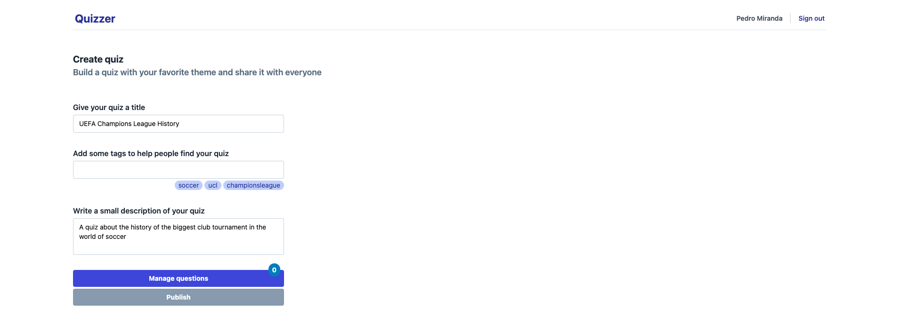
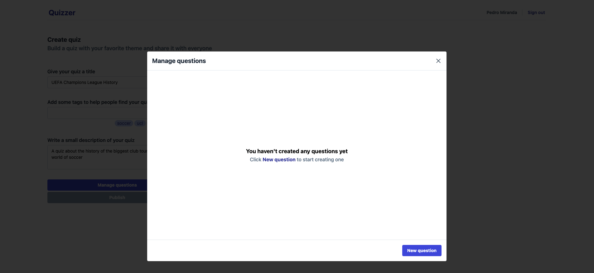
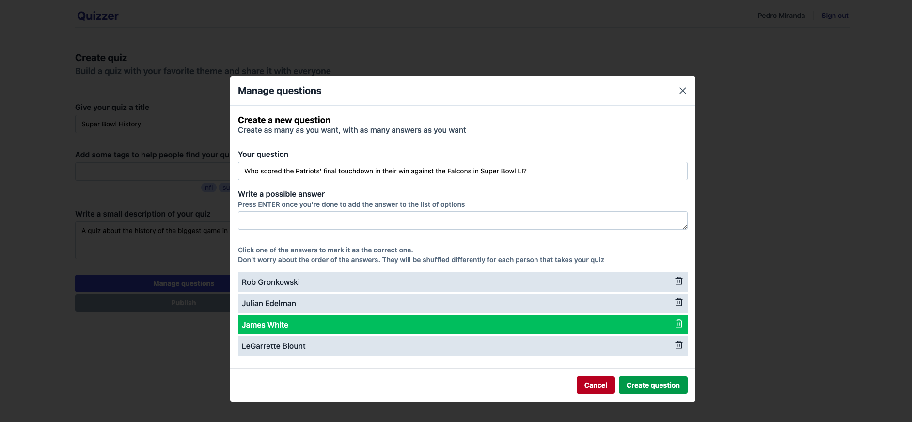
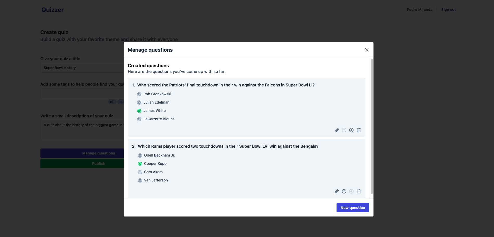
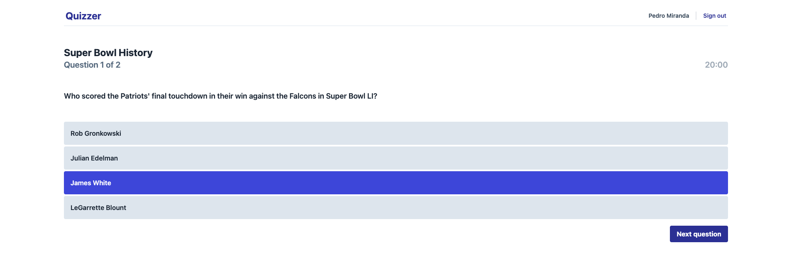

_**This is a work in progress**_

Quizzer is an app where users can create and answer quizzes. Its core stack is the [T3 stack](https://create.t3.gg/).

## Running the app

1. Clone/fork this repository
2. Install the dependencies with `pnpm install`
3. Create an OAuth 2.0 app in Google. You will need a client id and secret for the authentication to work.
4. Make sure you have Postgres running. I've set up a `docker-compose.yml` file with Postgres, so if you have Docker installed just run `docker-compose up` on your terminal.
5. Set up your environment following the .env.example file.
6. Push the Prisma migrations to the database by running `pnpm prisma db push`.
7. Run the app with `pnpm run dev`.

## Helpful Links

- [NextAuth Docs](https://next-auth.js.org/)
- [How to set up OAuth 2.0 in Google](https://support.google.com/cloud/answer/6158849?hl=en&ref_topic=3473162)
- [Prisma Docs](https://www.prisma.io/docs/)

## Screenshots

Here are a few images of what was built so far

